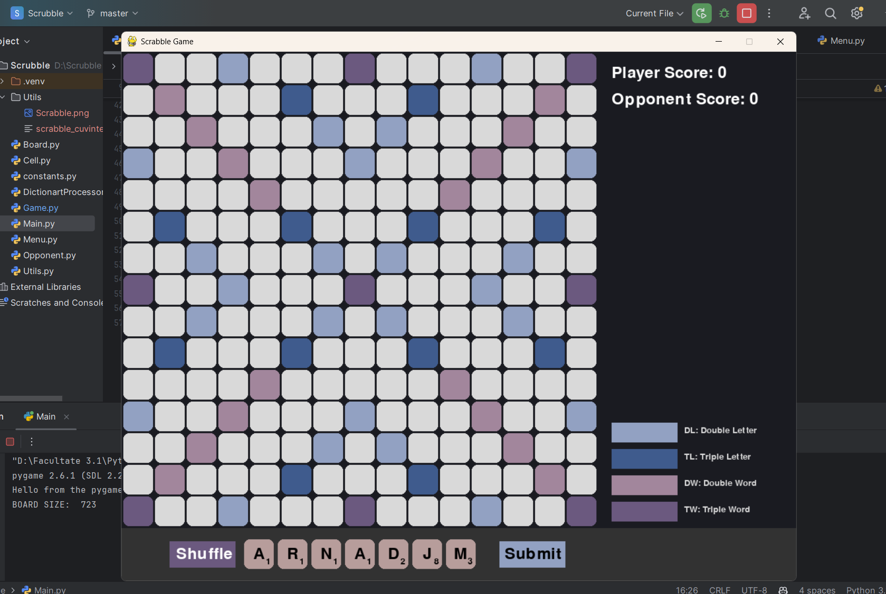
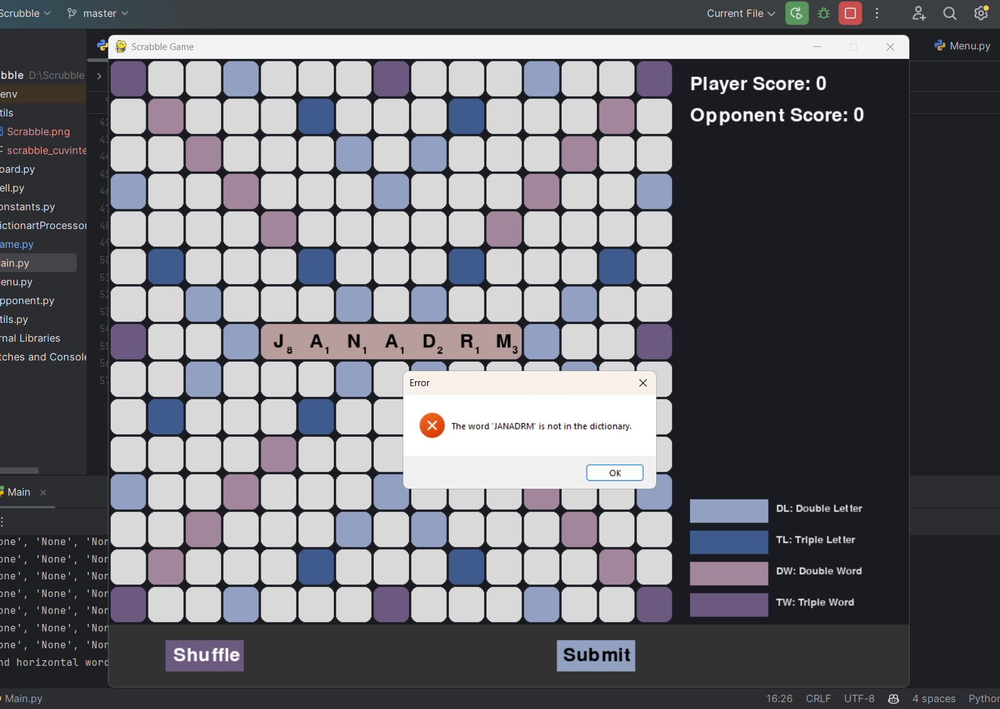
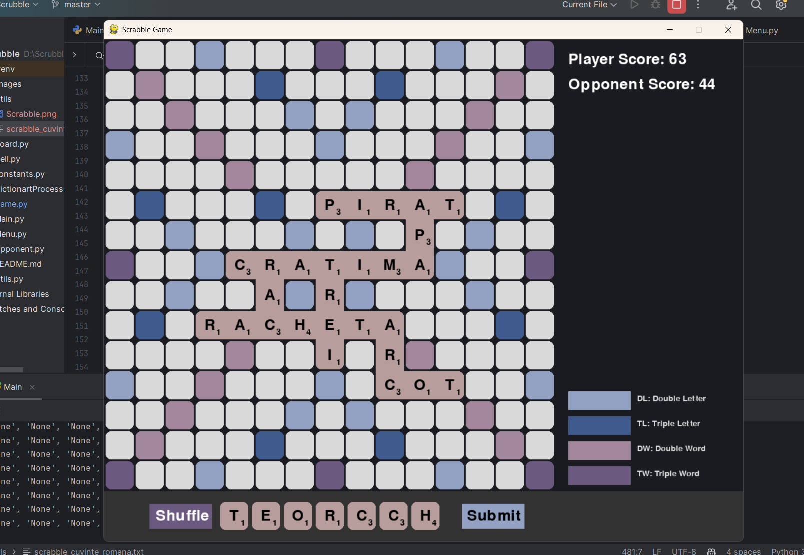

# SCRABBLE :nerd_face:
Acesta reprezinta proiectul la disciplica Python . Proiectul consta intr-o interfata grafiva ce ofera utilizatorului posibilitatea de a juca jocul Scrabble. Cand script-ul se ruleaza, se incepe o sesiune de joc contra unui oponent/calculatorului (programat sa urmeze anumite actiuni), iar dupa fiecare partida de joc se va afisa castigatorul (acesta fiind cel care are scorul cel mai mare jucatorul sau calculatorul).

## MODUL DE RULARE
Jocul incepe simplu: se va da start din program. Dupa pornirea jocului se va afisa fereastra principala: 

Pentru a incepe jocul, va trebui sa adaugam un fisier care contine pe fiecare linie cate un cuvant
, fisier ce va reprezenta dictionarul de cuvinte ce vor putea fi folosite in joc, apoi se va apasa butonul "Start joc".

Dupa intrarea in joc, prima incercare de a forma un cuvant ii apartine jucatorului. El va trebui sa formeze un cuvant cu literele furnizate, apoi sa apese submit pentru a se valida cuvantul. Jucatorul are posibilitatea si de a reamesteca literele folosind butonul "Suffle".

Daca utilizatorul va introduce un cuvant ce nu exita in dictionarul/fisierul furnizat la inceputul jocului, va fi atentionat printru-un mesaj de eroare. 

Scorul este actualizat dupa fiecare adaugare a unui cuvant nou. In momentul in care nu se mai pot forma cuvinte (nu mai exista spatiu suficient) se va alege castigatorul reprizei pe baza scorului.

# REGULILE JOCULUI

Scopul jocului consta in acumularea a cat mai multe puncte. Punctele se acumuleaza prin formarea cuvintelor - fiecare litera are un scor -  aceste scoruri sunt adunate formand un scor al cuvantului final. Pe tabla de joc sunt si casete speciale care maresc scorul cuvantului. 

Jucatorul trebuie sa respecte cateva reguli: 
 - trebuie sa formeze un cuvant valid ( valid = cuvant din fisierul introdus la inceputul jocului)
 - cuvantul trebuie sa aiba minim 2 litere
 - cuvantul trebuie sa fie conectat macar cu un cuvant deja aflat pe tabla - simplificand : un nou cuvant introduc pe tabla trebuie sa contina macar o litera dintr un alt cuvant de pe tabla
 - orice conexiune a doua litere trebuie sa fie un cuvant valid - practic nu se vor putea adauga doua cuvinte orizontale unul sub altul
 - la fiecare iteratie, jucatorul trebuie sa introduca un cuvant - daca va da submit fara sa adauge un cuvant, va fi instiintat printr-un mesaj de eroare

