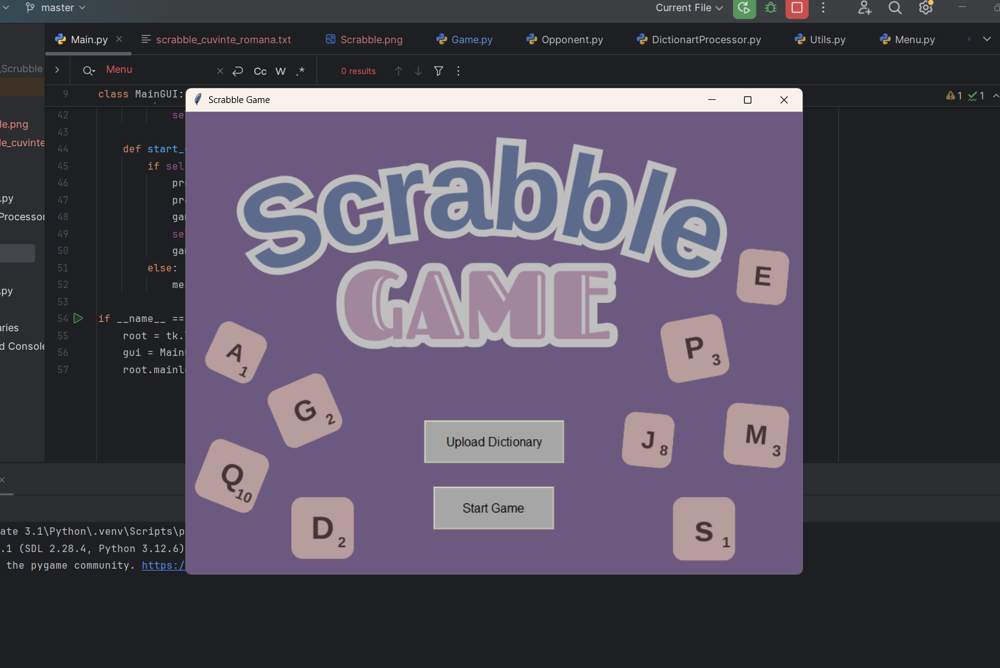

# SCRABBLE :nerd_face:
Acesta reprezinta proiectul la disciplica Python . Proiectul consta intr-o interfata grafiva ce ofera utilizatorului posibilitatea de a juca jocul Scrabble. Cand script-ul se ruleaza, se incepe o sesiune de joc contra unui oponent/calculatorului (programat sa urmeze anumite actiuni), iar dupa fiecare partida de joc se va afisa castigatorul (acesta fiind cel care are scorul cel mai mare jucatorul sau calculatorul).

## MODUL DE RULARE
Jocul incepe simplu: se va da start din program. Dupa pornirea jocului se va afisa fereastra principala: 

Pentru a incepe jocul, va trebui sa adaugam un fisier care contine pe fiecare linie cate un cuvant
, fisier ce va reprezenta dictionarul de cuvinte ce vor putea fi folosite in joc, apoi se va apasa butonul "Start joc".

Dupa intrarea in joc, prima incercare de a forma un cuvant ii apartine jucatorului. El va trebui sa formeze un cuvant cu literele furnizate, apoi sa apese submit pentru a se valida cuvantul. Jucatorul are posibilitatea si de a reamesteca literele folosind butonul "Suffle".

